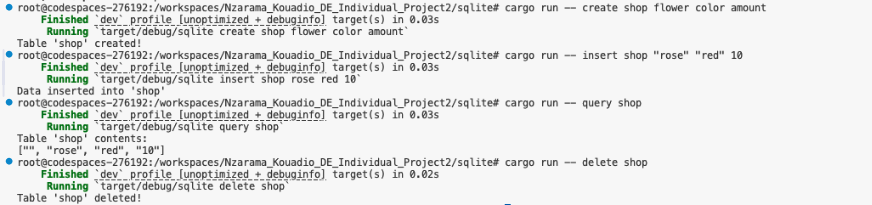
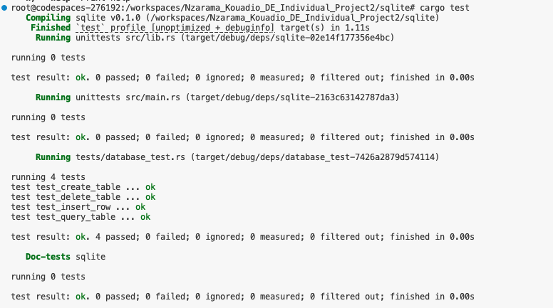

# Rust CLI Project: CRUD Operations with SQLite

This project is a Rust-based Command Line Interface (CLI) application that interacts with a SQLite database to perform CRUD (Create, Read, Update, Delete) operations. It includes an optimized Rust binary generated through CI/CD, allowing users to download and run the compiled application directly. ChatGPT was utilized to assist with building and coding the algorithm in Rust. 

## Project Overview

This CLI tool provides the following operations:

- **Create**: Set up a table with specified columns.
- **Insert**: Add rows of data to an existing table.
- **Query**: Display the contents of a specified table.
- **Delete**: Remove a table from the database.

The database is saved in a file (`my_database.db`) for persistence between runs.

## Important Files

- `src/main.rs`: Contains the CLI logic and commands for CRUD operations.
- `src/database.rs`: Implements the database struct and CRUD methods.
- `tests/database_test.rs`: Unit tests for verifying CRUD functionality.
- `Cargo.toml`: Manages dependencies.
- `.github/workflows/CI.yml`: CI/CD configuration for automated testing and artifact generation.

## Dependency Overview

- **rusqlite**: SQLite database management.
- **clap**: Command-line argument parsing.

## Setup Instructions

### Prerequisites
- [Rust](https://www.rust-lang.org/) installed on your machine.

### Clone the Repository
```bash
git clone https://github.com/nogibjj/Nzarama_Kouadio_DE_Individual_Project2.git
cd <project-directory>/sqlite
```

### Running Commands

There are two methods to run the CLI tool: directly from the source code or by using the compiled binary.

#### 1. Running from Source Code

1. **Build and Run**  
   ```bash
   cargo build
   cargo run -- <command> <options>
   ```
   Example:
   ```bash
   cargo run -- create users name age
   ```

#### 2. Using the Binary Executable (requires building first)

1. **Build the Project in Release Mode**  
   ```bash
   cargo build --release
   ```

2. **Navigate to the Release Directory**  
   ```bash
   cd target/release
   ```

3. **Run the Binary**  
   ```bash
   ./sqlite <command> <options>
   ```

## Usage Examples

Below are examples of how to use the CLI for each CRUD operation:

- **Create a Table**  
  ```bash
  cargo run -- create shop flower color amount
  ```

- **Insert Data**  
  ```bash
  cargo run -- insert shop "rose" "red" 10
  ```

- **Query Table**  
  ```bash
  cargo run -- query shop
  ```

- **Delete Table**  
  ```bash
  cargo run -- delete shop
  ```



## Continuous Integration and Deployment (CI/CD)

This project includes a GitHub Actions workflow that automates essential tasks to maintain code quality and functionality. Each task runs automatically with each new commit or pull request to the repository.

### Code Quality and Build
- **Formatting**:checks and corrects code formatting with command `cargo fmt`
- **Linting**: Runs `cargo clippy` to analyze code for potential issues and enforce best practices
- **Build**: Compiles the Rust code with `cargo build` to ensure there are no compilation errors and produce an optimized binary.

### Testing
- **Unit Tests**: Executes tests defined in `database_test.rs`, which validate the functionality of each CRUD operation in the project. These tests cover:
  - **Table Creation**: Ensuring tables are created with specified columns.
  - **Data Insertion**: Verifying that data can be correctly inserted into tables.
  - **Data Querying**: Checking that data can be accurately retrieved from tables.
  - **Table Deletion**: Confirming tables can be deleted without issues.

> Running these tests helps catch any functionality issues early, ensuring that the core CRUD operations behave as expected.


### Binary Artifact
- **Artifact Creation**: After successful builds, the workflow produces a downloadable binary file of the project, making it accessible for deployment or testing on different systems. You can access the binary in the GitHub Actions tab for each workflow run.


## Usage of LLM: Chat Gpt for Assistance

Throughout this project, I utilized ChatGPT as a valuable resource to support my coding efforts, especially since Rust is a relatively new language for me. ChatGPT assisted in multiple areas:

- **Debugging**: When I encountered errors, particularly in syntax and structuring, ChatGPT helped identify the issues and provided guidance to resolve them.

- **Rust Syntax and Concepts**: Since I’m new to Rust, ChatGPT was crucial in helping me understand the syntax and correct usage of Rust-specific features, such as managing error handling and working with modules.

- **Alternative Solutions to Hardcoding**: Initially, I considered hardcoding certain aspects of the code (such as specifying fixed columns and rows). However, ChatGPT suggested a more flexible approach using dynamic methods to handle table creation and data insertion, which improved the overall structure and reusability of the code.

By using ChatGPT, I could navigate the challenges of working with Rust more effectively, enhancing both the functionality and adaptability of the CLI database project.

## Video

Here is a YouTube link showcasing a walkthrough of my CLI binary: 
